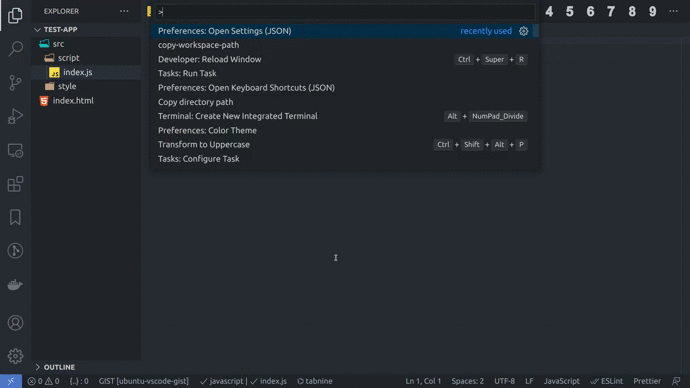
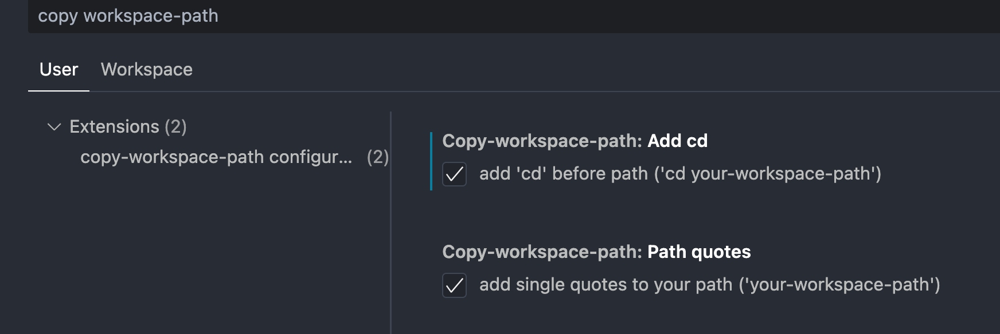

# copy workspace path extension

**A sad story:** :disappointed:
It is my first extension. I spent a day watching videos and reading documentation to make this extension, and then I found how to open an external shell from an editor with the correct directory - `Ctrl + Shift + C`. :man_facepalming: So, you probably do not need this extension. But if you want just copy your app's path, you are welcome :smiley:

***

Copy workspace path.  
In other words, the path of your project's root folder.

Open Command Palette and type `copy-workspace-path` to copy or press `Ctrl + Alt + P` ( to change it you can find the command `copy-workspace-path` in keyboard shortcuts )

[`Extension`](https://marketplace.visualstudio.com/items?itemName=Malashevskyi.copy-workspace-path)

If you don't want to type `cd`, you can copy the path with `cd` (`cd path`),   go to settings and check `Add cd` (reload required after changing)

